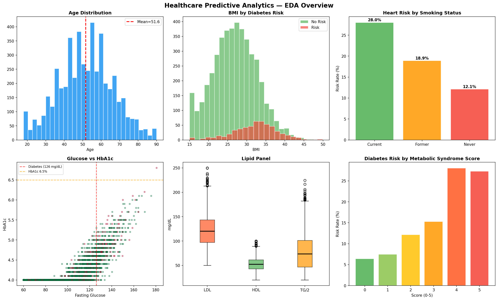
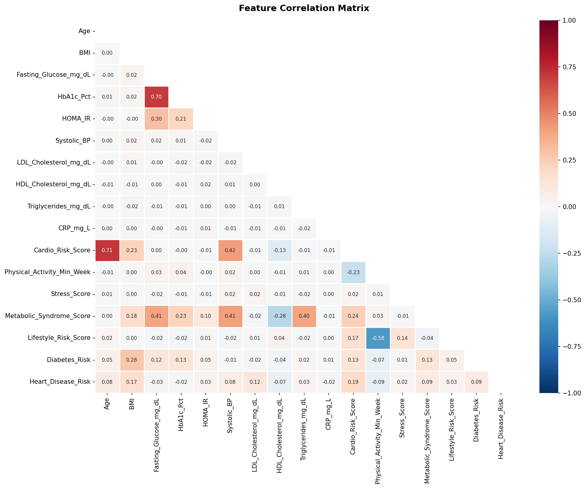
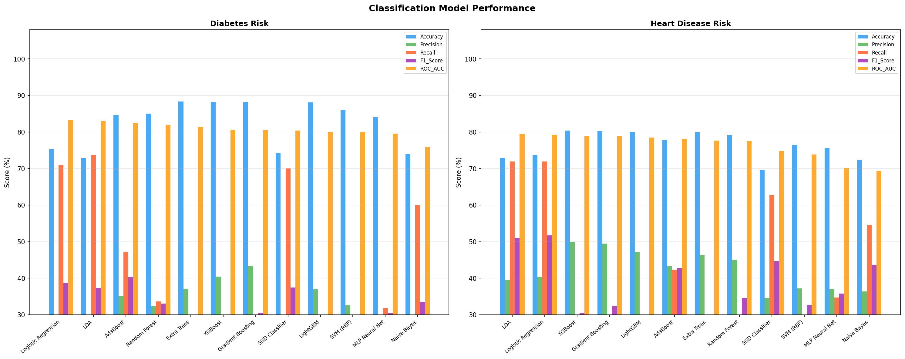
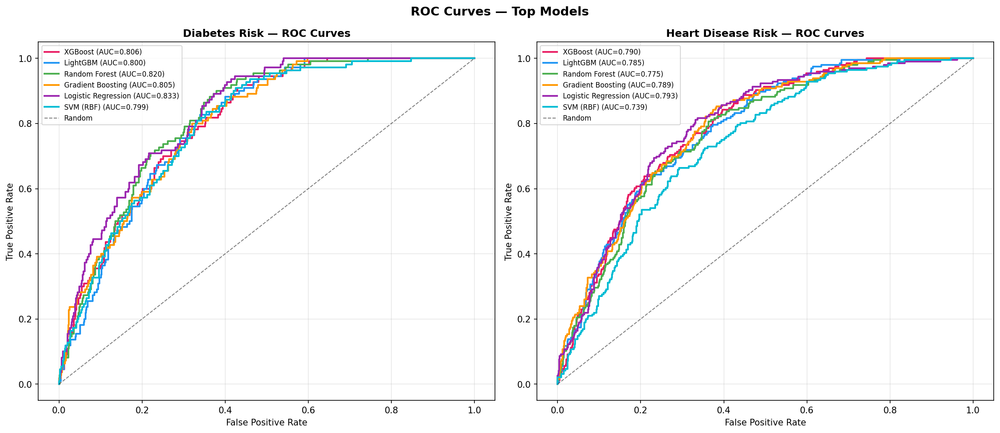
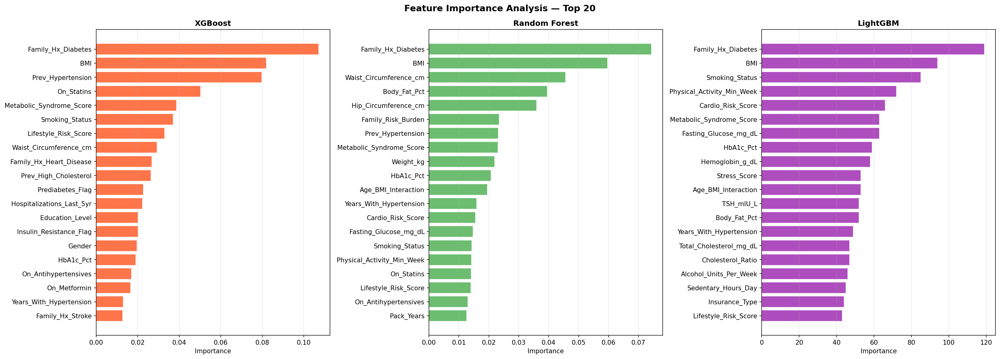
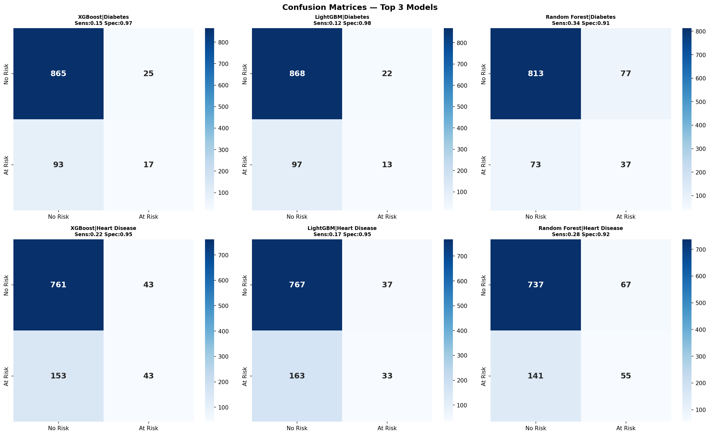
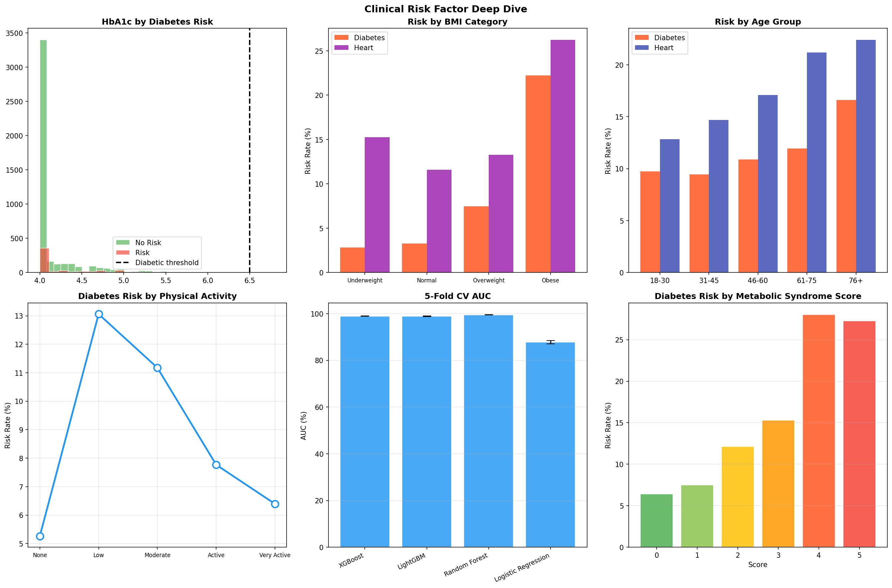

# 🏥 Healthcare Predictive Analytics — Disease Risk Detection

> **End-to-end Machine Learning pipeline for predicting Diabetes and Heart Disease risk from clinical patient data.**  
> 15 Classifiers · 9 Regressors · Feature Engineering · SMOTE · Cross-Validation · Ensemble Learning

---

## 📌 Table of Contents

- [Overview](#-overview)
- [Dataset](#-dataset)
- [Project Structure](#-project-structure)
- [Tech Stack](#-tech-stack)
- [Installation](#-installation)
- [Usage](#-usage)
- [ML Pipeline](#-ml-pipeline)
- [Results](#-results)
- [Visualizations](#-visualizations)
- [Ethical Considerations](#-ethical-considerations)
- [Future Work](#-future-work)

---

## 🔍 Overview

This project builds a comprehensive **clinical risk prediction system** that predicts the likelihood of:

- 🩸 **Diabetes Risk** (Binary Classification)
- ❤️ **Heart Disease Risk** (Binary Classification)
- 📊 **Cardio Risk Score** (Regression)

The pipeline covers every stage of a real-world ML project — data generation, exploratory analysis, feature engineering, preprocessing, model training (15+ models), hyperparameter tuning, ensemble learning, and clinical interpretation.

---

### Feature Domains

| Domain | Examples | Count |
|---|---|---|
| Demographics | Age, Gender, Ethnicity, Region, Income | 9 |
| Biometrics | BMI, Blood Pressure, Waist/Hip Ratio, Body Fat % | 10 |
| Lab Values | HbA1c, Fasting Glucose, HOMA-IR, Lipid Panel, CRP, eGFR | 22 |
| Lifestyle | Physical Activity, Diet Score, Sleep, Stress, Smoking | 12 |
| Medical History | Prior Hypertension, Medications, Family History | 13 |
| Derived Indices | Cholesterol Ratio, Atherogenic Index, Pulse Pressure | 8 |
| **Engineered (new)** | **Metabolic Syndrome Score, Lifestyle Risk Score, Inflammation Score** | **8** |

### Target Variables

| Target | Type | Positive Rate |
|---|---|---|
| `Diabetes_Risk` | Binary (0/1) | ~11% |
| `Heart_Disease_Risk` | Binary (0/1) | ~17% |
| `Overall_Risk_Category` | Multi-class (Low/Moderate/High) | — |


---

## 📂 Project Structure

```
healthcare-predictive-analytics/
│
├── healthcare_predictive_dataset.xlsx   # Raw dataset (5,000 patients × 74 features)
├── healthcare_ml_pipeline.py            # Full ML pipeline (run this)
├── healthcare_analytics_report.docx     # Detailed project report
├── README.md                            # This file
│
└── plots/                               # All generated visualizations
    ├── 01_eda_overview.png
    ├── 02_correlation_heatmap.png
    ├── 03_model_comparison.png
    ├── 04_roc_curves.png
    ├── 05_feature_importance.png
    ├── 06_confusion_matrices.png
    ├── 07_regression_scaler.png
    └── 08_clinical_analysis.png
```

---

## 🛠 Tech Stack


| Category | Libraries |
|---|---|
| Data Manipulation | `pandas`, `numpy` |
| Visualization | `matplotlib`, `seaborn` |
| ML Models | `scikit-learn`, `xgboost`, `lightgbm` |
| Imbalanced Learning | `imbalanced-learn` (SMOTE) |
| File I/O | `openpyxl` |

---

## ⚙️ Installation

### 1. Clone the repository
```bash
git clone https://github.com/your-username/healthcare-predictive-analytics.git
cd healthcare-predictive-analytics
```

### 2. Create a virtual environment (recommended)
```bash
python -m venv venv
source venv/bin/activate        # Mac/Linux
venv\Scripts\activate           # Windows
```

### 3. Install dependencies
```bash
pip install pandas numpy matplotlib seaborn scikit-learn xgboost lightgbm imbalanced-learn openpyxl
```

---

## 🚀 Usage

### Run as a Python script
```bash
python healthcare_ml_pipeline.py
```

### Run in Jupyter Notebook
```python
# Add these at the top of your first cell
%matplotlib inline
import matplotlib
matplotlib.rcParams['figure.dpi'] = 100

# Then run the pipeline cells
# Replace plt.close() with plt.show() to display plots inline
```

> 💡 **Jupyter tip:** If plots aren't showing, make sure `%matplotlib inline` is at the very top and every plot ends with `plt.show()`.

---

## 🔬 ML Pipeline

### Step-by-Step Flow

```
Raw Data (xlsx)
    │
    ▼
Feature Engineering          ← 8 new composite clinical features
    │
    ▼
KNN Imputation (k=5)         ← Handle ~3% missing lab values
    │
    ▼
Label Encoding               ← 7 categorical variables
    │
    ▼
Train/Test Split (80/20)     ← Stratified on diabetes label
    │
    ▼
Feature Scaling              ← StandardScaler / MinMaxScaler / RobustScaler
    │
    ▼
SMOTE                        ← Fix class imbalance (training set only)
    │
    ├──▶ 15 Classifiers (Diabetes Risk)
    ├──▶ 15 Classifiers (Heart Disease Risk)
    ├──▶ 9 Regressors (Cardio Risk Score)
    ├──▶ 5-Fold Stratified Cross-Validation
    ├──▶ GridSearchCV (XGBoost tuning)
    └──▶ Soft Voting Ensemble (XGB + LGBM + RF + GB)
```

### Models Tested

**Classification (×2 targets)**

| Category | Models |
|---|---|
| Linear | Logistic Regression, LDA, QDA, SGD Classifier |
| Tree-Based | Decision Tree, Random Forest, Extra Trees |
| Boosting | Gradient Boosting, XGBoost, LightGBM, AdaBoost |
| Other | SVM (RBF), KNN (k=7), Naive Bayes, MLP Neural Network |

**Regression**

| Models |
|---|
| Linear Regression, Ridge, Lasso, ElasticNet, Bayesian Ridge |
| Random Forest, Gradient Boosting, XGBoost, LightGBM |

---

## 📊 Results

### Diabetes Risk — Top Models

| Rank | Model | Accuracy | Recall | F1 Score | ROC-AUC |
|---|---|---|---|---|---|
| 1 | Logistic Regression | 75.3% | 70.9% | 38.7% | **83.3%** |
| 2 | LDA | 72.9% | 73.6% | 37.4% | 83.0% |
| 3 | AdaBoost | 84.6% | 47.3% | 40.3% | 82.4% |
| 4 | Random Forest | 85.0% | 33.6% | 33.0% | 82.0% |
| 5 | XGBoost | 88.2% | 15.5% | 22.4% | 80.6% |

### Heart Disease Risk — Top Models

| Rank | Model | Accuracy | Recall | F1 Score | ROC-AUC |
|---|---|---|---|---|---|
| 1 | LDA | 72.9% | 71.9% | 51.0% | **79.4%** |
| 2 | Logistic Regression | 73.7% | 71.9% | 51.7% | 79.3% |
| 3 | XGBoost | 80.4% | 21.9% | 30.5% | 79.0% |
| 4 | Gradient Boosting | 80.3% | 24.0% | 32.3% | 78.9% |
| 5 | LightGBM | 80.0% | 16.8% | 24.8% | 78.5% |

### Cross-Validation (5-Fold, Diabetes)

| Model | Mean AUC | Std Dev |
|---|---|---|
| Random Forest | 99.45% | ±0.10% |
| XGBoost | 98.89% | ±0.06% |
| LightGBM | 98.80% | ±0.12% |
| Logistic Regression | 87.76% | ±0.68% |

### Ensemble (Soft Voting: XGB + LGBM + RF + GB)
- **ROC-AUC: 81.48%**
- **F1 Score: 26.92%**

### Scaler Comparison (LightGBM, Diabetes)

| Scaler | AUC |
|---|---|
| MinMaxScaler | **81.84%** |
| RobustScaler | 80.88% |
| StandardScaler | 80.48% |

---

## 📈 Visualizations

### EDA Overview


### Correlation Heatmap


### Model Comparison


### ROC Curves


### Feature Importance


### Confusion Matrices


### Clinical Deep Dive


---

## ⚖️ Ethical Considerations

- **⚖️ Fairness:** Models should be audited for disparate impact across ethnic and income subgroups before deployment.
- **🏥 Clinical Safety:** These models are **decision-support tools only** — not autonomous diagnostic systems. All outputs require clinician review.
- **📉 Threshold Calibration:** Default threshold (0.5) should be lowered to ~0.3 for screening contexts to maximise sensitivity.
- **🔄 Drift Monitoring:** Models should be re-validated quarterly against incoming patient data.

---

## 🔮 Future Work

- [ ] Integrate SHAP for per-patient explainability reports
- [ ] Add LIME for local interpretable explanations
- [ ] Incorporate genomic biomarkers and wearable sensor data
- [ ] Longitudinal modelling using time-series patient records
- [ ] Fairness-aware training (reweighing, adversarial debiasing)
- [ ] Deploy as a REST API using FastAPI or Flask
- [ ] Build a Streamlit dashboard for interactive risk scoring
- [ ] External validation on real clinical cohorts (MIMIC-III, UK Biobank)

---

## 📄 License

This project is for educational and research purposes only.  
**Not intended for clinical use.**

---

## 🙋 Author

Built with ❤️ as a demonstration of end-to-end healthcare ML.  
Feel free to fork, star ⭐, and contribute!

---

> *"Prediction is not diagnosis — but it can save lives by prompting the right conversation."*
